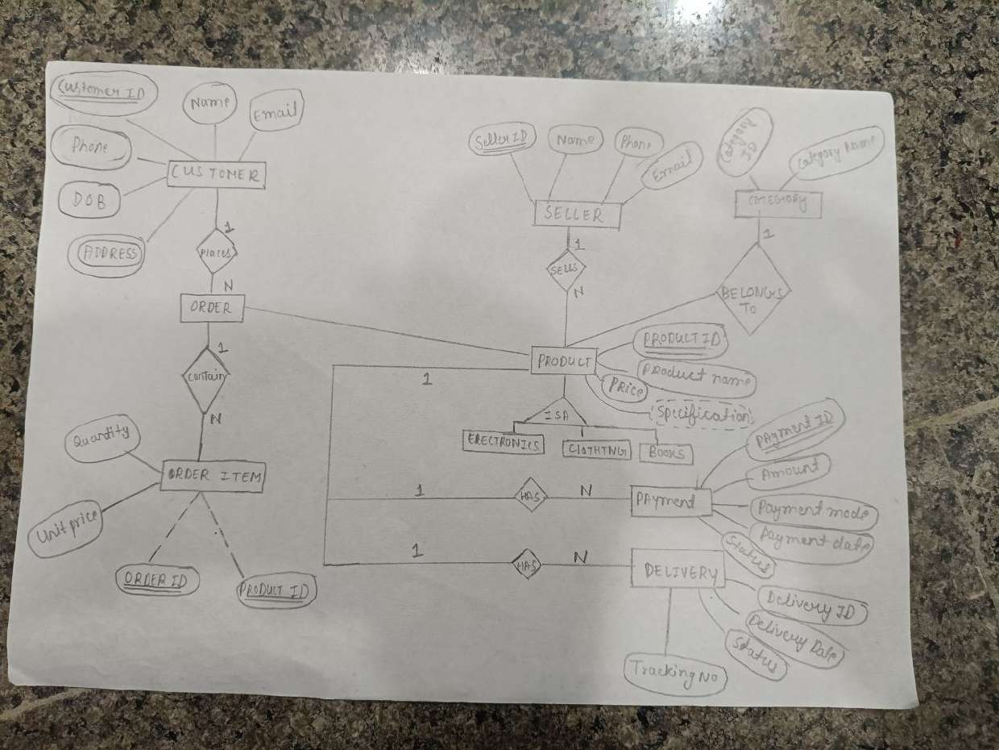
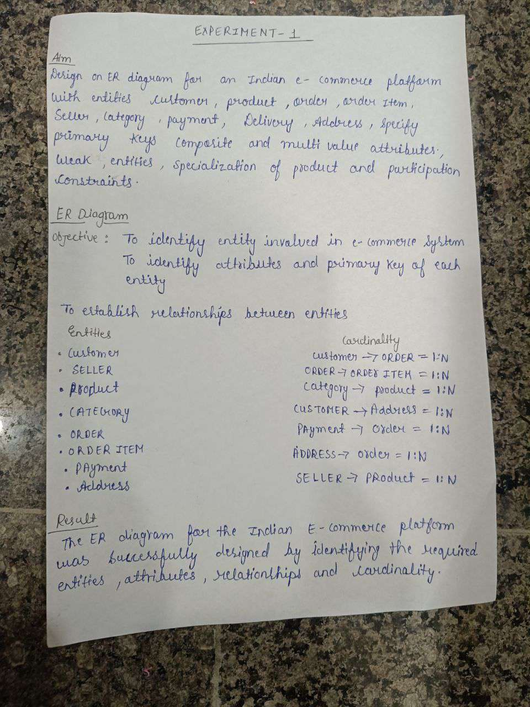

# EXPERIMENT - 1

## Aim

Design an ER diagram for an Indian e-commerce platform with entities Customer, Product, Order, Order Item, Seller, Category, Payment, Delivery, Address. Specify primary keys, composite and multi-valued attributes, weak entities, specialization of product and participation constraints.

## ER Diagram

### Objective

- To identify entities involved in the e-commerce system
- To identify attributes and primary key of each entity
- To establish relationships between entities

### Entities

- Customer
- Seller
- Product
- Category
- Order
- Order Item
- Payment
- Address

### Cardinality

| Relationship | Cardinality |
|---|---|
| Customer → Order | 1:N |
| Order → Order Item | 1:N |
| Category → Product | 1:N |
| Customer → Address | 1:N |
| Payment → Order | 1:N |
| Address → Order | 1:N |
| Seller → Product | 1:N |

### Attributes (from the diagram)

| Entity | Attributes |
|---|---|
| Customer | Customer ID (PK), Name, Email, Phone, DOB, Address |
| Seller | Seller ID (PK), Name, Phone, Email |
| Category | Category ID (PK), Category Name |
| Product | Product ID (PK), Product Name, Price, Specification (multi-valued); specialized (ISA) into Electronics, Clothing, Books |
| Order Item (weak entity) | Order ID + Product ID (partial keys), Quantity, Unit Price |
| Payment | Payment ID (PK), Amount, Payment Mode, Payment Date, Status |
| Delivery | Delivery ID (PK), Delivery Date, Status, Tracking No |

### Relationships in the diagram

Customer *places* Order (1:N), Order *contains* Order Item (1:N), Seller *sells* Product (1:N), Category *belongs to* Product (1:N), Payment *has* (1:N), Delivery *has* (1:N).

## Result

The ER diagram for the Indian E-commerce platform was successfully designed by identifying the required entities, attributes, relationships and cardinality.

---

Original handwritten notes: 
