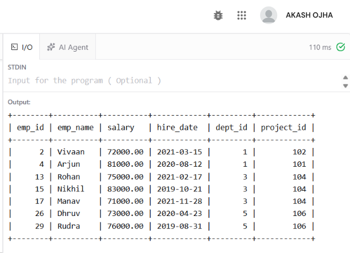
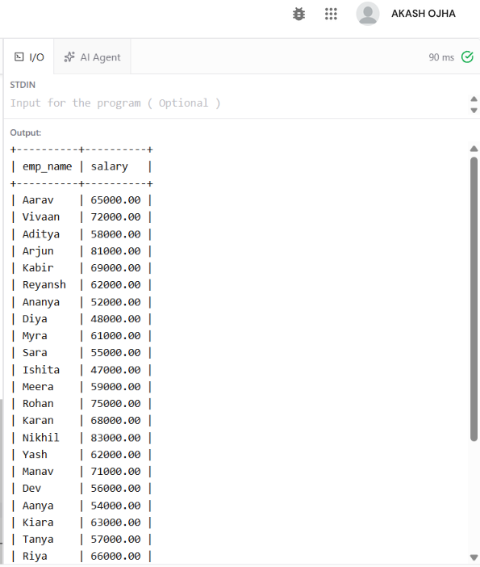
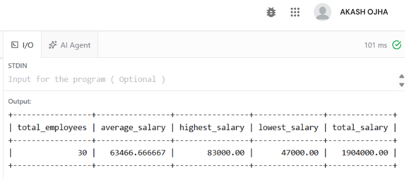
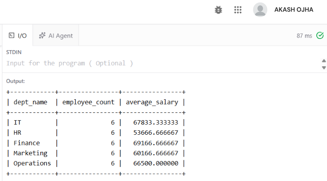
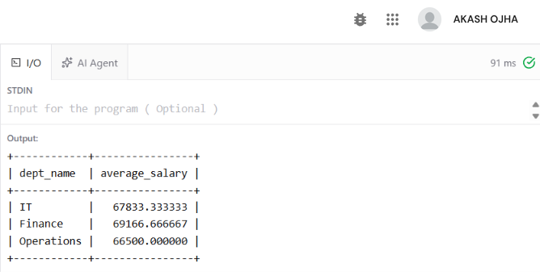
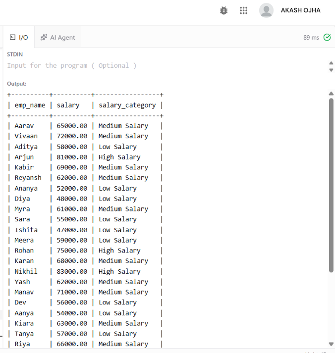
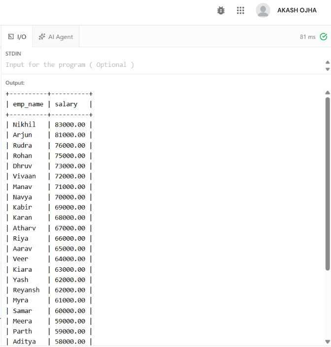
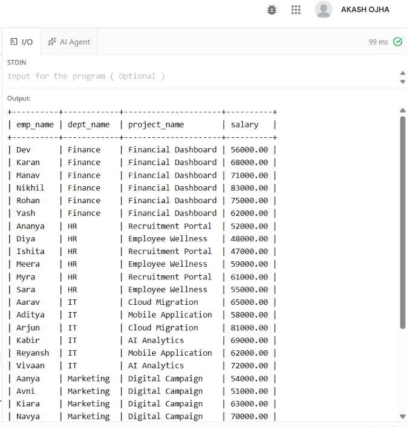

**EXPERIMENT -3**

**AIM**

To create an Employee–Department–Project relational database, insert at least 30 employees across 5 departments and 8 projects, and demonstrate SQL queries using **Selection, Projection, Aggregate Functions, GROUP BY, HAVING, CASE expressions, and ORDER BY**.

**SOURCE CODE**

```sql
CREATE DATABASE CompanyDB;

USE CompanyDB;

CREATE TABLE Department (
dept_id INT PRIMARY KEY,
dept_name VARCHAR(50) NOT NULL
);

CREATE TABLE Project (
project_id INT PRIMARY KEY,
project_name VARCHAR(100) NOT NULL,
budget DECIMAL(12,2),
dept_id INT,
FOREIGN KEY (dept_id) REFERENCES Department(dept_id)
);

CREATE TABLE Employee (
emp_id INT PRIMARY KEY,
emp_name VARCHAR(50) NOT NULL,
salary DECIMAL(10,2),
hire_date DATE,
dept_id INT,
project_id INT,
FOREIGN KEY (dept_id) REFERENCES Department(dept_id),
FOREIGN KEY (project_id) REFERENCES Project(project_id)
);
```

**Insert Departments**

```sql
INSERT INTO Department VALUES
(1,'IT'),
(2,'HR'),
(3,'Finance'),
(4,'Marketing'),
(5,'Operations');
```

**Insert Projects**

```sql
INSERT INTO Project VALUES
(101,'Cloud Migration',150000,1),
(102,'AI Analytics',200000,1),
(103,'Recruitment Portal',80000,2),
(104,'Financial Dashboard',120000,3),
(105,'Digital Campaign',90000,4),
(106,'Supply Chain System',180000,5),
(107,'Mobile Application',140000,1),
(108,'Employee Wellness',60000,2);
```

**Insert 30 Employees**

```sql
INSERT INTO Employee VALUES
(1,'Aarav',65000,'2022-01-10',1,101),
(2,'Vivaan',72000,'2021-03-15',1,102),
(3,'Aditya',58000,'2023-06-20',1,107),
(4,'Arjun',81000,'2020-08-12',1,101),
(5,'Kabir',69000,'2022-11-05',1,102),
(6,'Reyansh',62000,'2024-02-18',1,107),
(7,'Ananya',52000,'2022-04-11',2,103),
(8,'Diya',48000,'2023-01-22',2,108),
(9,'Myra',61000,'2021-07-19',2,103),
(10,'Sara',55000,'2022-09-30',2,108),
(11,'Ishita',47000,'2024-03-14',2,103),
(12,'Meera',59000,'2020-12-01',2,108),
(13,'Rohan',75000,'2021-02-17',3,104),
(14,'Karan',68000,'2022-05-09',3,104),
(15,'Nikhil',83000,'2019-10-21',3,104),
(16,'Yash',62000,'2023-08-13',3,104),
(17,'Manav',71000,'2021-11-28',3,104),
(18,'Dev',56000,'2024-01-09',3,104),
(19,'Aanya',54000,'2022-02-25',4,105),
(20,'Kiara',63000,'2021-06-16',4,105),
(21,'Tanya',57000,'2023-04-10',4,105),
(22,'Riya',66000,'2020-09-07',4,105),
(23,'Avni',51000,'2024-02-05',4,105),
(24,'Navya',70000,'2022-12-19',4,105),
(25,'Samar',60000,'2021-01-12',5,106),
(26,'Dhruv',73000,'2020-04-23',5,106),
(27,'Atharv',67000,'2022-07-18',5,106),
(28,'Parth',59000,'2023-05-29',5,106),
(29,'Rudra',76000,'2019-08-31',5,106),
(30,'Veer',64000,'2024-01-20',5,106);
```

**SQL QUERIES**

**1. Selection**

Display employees whose salary is greater than 70,000.

```sql
SELECT *
FROM Employee
WHERE salary > 70000;
```

**OUTPUT**



**2. Projection**

Display only employee names and salaries.

```sql
SELECT emp_name, salary
FROM Employee;
```

**OUTPUT**



**3. Aggregate Functions**

Find total employees, average salary, maximum salary, minimum salary and total salary.

```sql
SELECT
COUNT(*) AS total_employees,
AVG(salary) AS average_salary,
MAX(salary) AS highest_salary,
MIN(salary) AS lowest_salary,
SUM(salary) AS total_salary
FROM Employee;
```



**4. GROUP BY**

Display the number of employees and average salary in each department.

```sql
SELECT
d.dept_name,
COUNT(e.emp_id) AS employee_count,
AVG(e.salary) AS average_salary
FROM Department d
JOIN Employee e
ON d.dept_id = e.dept_id
GROUP BY d.dept_id, d.dept_name;
```

**OUTPUT**



**5. HAVING**

Display departments whose average salary is greater than 65,000.

```sql
SELECT
d.dept_name,
AVG(e.salary) AS average_salary
FROM Department d
JOIN Employee e
ON d.dept_id = e.dept_id
GROUP BY d.dept_id, d.dept_name
HAVING AVG(e.salary) > 65000;
```

**OUTPUT**

**6. CASE Expression**

Classify employees according to their salary.

```sql
SELECT
emp_name,
salary,
CASE
WHEN salary >= 75000 THEN 'High Salary'
WHEN salary >= 60000 THEN 'Medium Salary'
ELSE 'Low Salary'
END AS salary_category
FROM Employee;
```

**OUTPUT**

**7. ORDER BY**

Display employees in descending order of salary.

```sql
SELECT emp_name, salary
FROM Employee
ORDER BY salary DESC;
```

**OUTPUT**

**8. JOIN Employee, Department and Project**

Display employee name, department, project and salary.

```sql
SELECT
e.emp_name,
d.dept_name,
p.project_name,
e.salary
FROM Employee e
JOIN Department d
ON e.dept_id = d.dept_id
JOIN Project p
ON e.project_id = p.project_id
ORDER BY d.dept_name, e.emp_name;
```

**OUTPUT**

**RESULT**

The **Employee–Department–Project database** was successfully created with:

- **30 Employees**

- **5 Departments**

- **8 Projects**

The following SQL concepts were successfully demonstrated:

1.  Selection

2.  Projection

3.  Aggregate Functions

4.  GROUP BY

5.  HAVING

6.  CASE Expression

7.  ORDER BY

8.  JOIN
