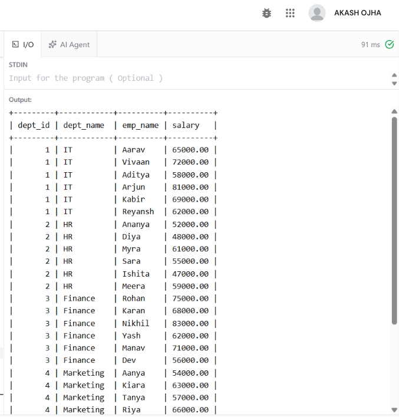
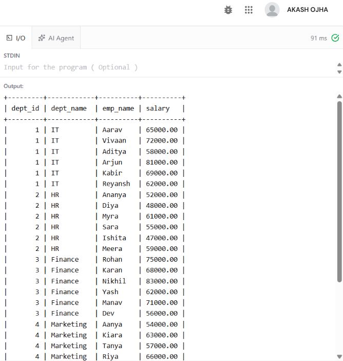
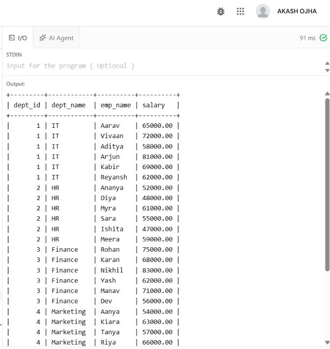
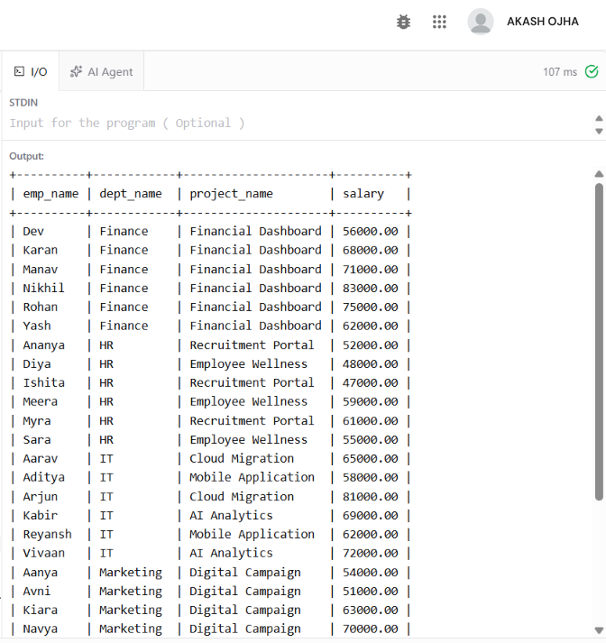
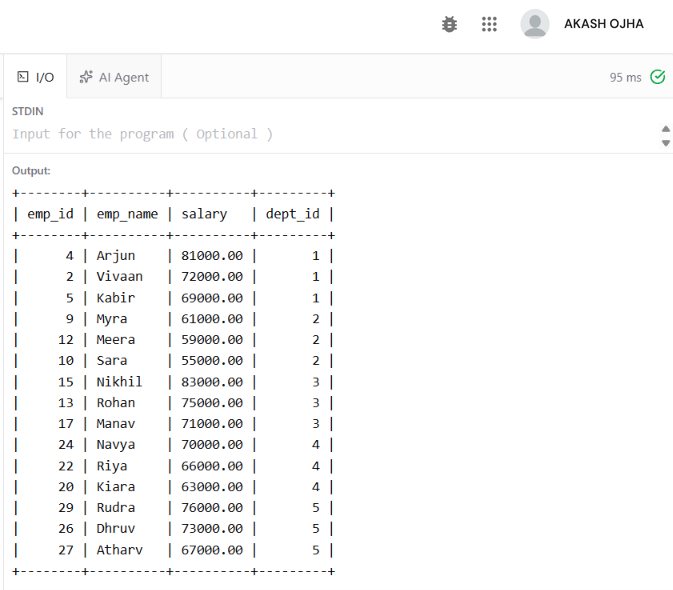
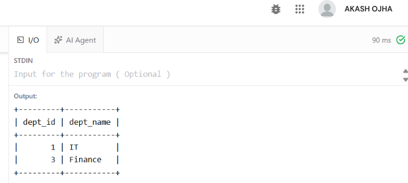
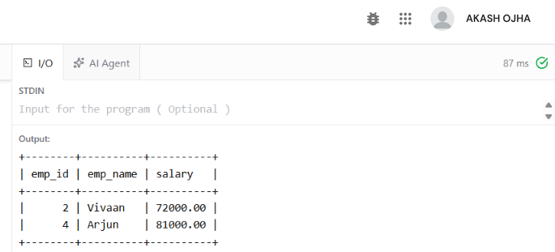
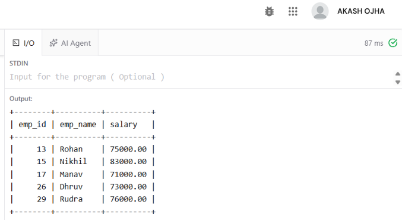

**EXPERIMENT - 4**

**AIM**

Using the Employee schema, write and execute SQL queries with INNER JOIN, LEFT JOIN, self-join, 3-way join, correlated subqueries, EXISTS, and simulated INTERSECT and EXCEPT. Compare the execution plans of selected queries using EXPLAIN.

**OBJECTIVES**

• To understand how different types of JOIN operations combine rows from related tables.

• To perform a self-join on the Employee table to compare employees within the same department.

• To use correlated subqueries and EXISTS for row-by-row and existence-based filtering.

• To simulate INTERSECT and EXCEPT operations using subqueries supported by MySQL.

• To inspect and compare query execution plans using EXPLAIN.

**DATABASE USED**

The queries use the CompanyDB database and the Employee–Department–Project schema from the reference experiment. The reference document defines 30 employees, 5 departments and 8 projects. The Employee table contains emp_id, emp_name, salary, hire_date, dept_id and project_id, with foreign keys to Department and Project.

```sql
USE CompanyDB;
```

**SCHEMA REFERENCE**

| **Table**  | **Important Columns**                                    | **Relationship**                              |
|------------|----------------------------------------------------------|-----------------------------------------------|
| Employee   | emp_id, emp_name, salary, hire_date, dept_id, project_id | dept_id → Department; project_id → Project    |
| Department | dept_id, dept_name                                       | Primary key: dept_id                          |
| Project    | project_id, project_name, budget, dept_id                | Primary key: project_id; dept_id → Department |

The source document creates Department, Project and Employee in this order and establishes the foreign-key relationships shown above.

**SOURCE CODE / SQL QUERIES**

**1. INNER JOIN**

Display employee names, salaries and their department names using an INNER JOIN.

```sql
SELECT
e.emp_id,
e.emp_name,
e.salary,
d.dept_name
FROM Employee e
INNER JOIN Department d
ON e.dept_id = d.dept_id
ORDER BY e.emp_id;
```

**Output**



The full query returns all 30 employees. The Department values come from the Department table in the reference data.

**2. LEFT JOIN**

Display all departments and the employees belonging to them. LEFT JOIN keeps every department from the left table even if no matching employee exists.

```sql
SELECT
d.dept_id,
d.dept_name,
e.emp_name,
e.salary
FROM Department d
LEFT JOIN Employee e
ON d.dept_id = e.dept_id
ORDER BY d.dept_id, e.emp_id;
```

**  
OUTPUT**



In the supplied data, all five departments have employees, so no NULL employee row appears. The LEFT JOIN would show a department with NULL employee columns if such a department existed.

**3. SELF-JOIN**

Compare two employees belonging to the same department. The Employee table is joined to itself using two aliases.

```sql
SELECT
e1.emp_name AS employee_1,
e2.emp_name AS employee_2,
e1.dept_id,
e1.salary AS salary_1,
e2.salary AS salary_2
FROM Employee e1
INNER JOIN Employee e2
ON e1.dept_id = e2.dept_id
AND e1.emp_id < e2.emp_id
ORDER BY e1.dept_id, e1.emp_id, e2.emp_id
LIMIT 10;
```

**  
OUTPUT (first 10 rows)**



The condition e1.emp_id \< e2.emp_id prevents the same pair from being repeated in reverse order and prevents an employee from being paired with itself.

**4. 3-WAY JOIN**

Display employee name, department, project and salary by joining Employee, Department and Project.

```sql
SELECT
e.emp_name,
d.dept_name,
p.project_name,
e.salary
FROM Employee e
INNER JOIN Department d
ON e.dept_id = d.dept_id
INNER JOIN Project p
ON e.project_id = p.project_id
ORDER BY d.dept_name, e.emp_name;
```

**OUTPUT** 

**  
**

The reference experiment uses the same three-table join pattern and orders the result by department and employee name.

**5. CORRELATED SUBQUERY**

Display employees whose salary is greater than the average salary of their own department. The inner query refers to the outer Employee row, making it a correlated subquery.

```sql
SELECT
e.emp_id,
e.emp_name,
e.salary,
e.dept_id
FROM Employee e
WHERE e.salary > (
SELECT AVG(e2.salary)
FROM Employee e2
WHERE e2.dept_id = e.dept_id
)
ORDER BY e.dept_id, e.salary DESC;
```

**  
OUTPUT**

The department averages used by this query are consistent with the reference experiment's GROUP BY/HAVING results, including IT 67833.33, Finance 69166.67 and Operations 66500.00.

**6. EXISTS**

Find departments that have at least one employee with a salary greater than 80,000.

```sql
SELECT
d.dept_id,
d.dept_name
FROM Department d
WHERE EXISTS (
SELECT 1
FROM Employee e
WHERE e.dept_id = d.dept_id
AND e.salary > 80000
)
ORDER BY d.dept_id;
```

**  
OUTPUT**



EXISTS returns TRUE as soon as the subquery finds at least one qualifying employee for the current department.

**7. SIMULATED INTERSECT**

MySQL can express the intersection of two employee sets by requiring the employee ID to occur in both subqueries. Here, the two sets are: employees in IT and employees whose salary is greater than 70,000.

```sql
SELECT emp_id, emp_name, salary
FROM Employee
WHERE emp_id IN (
SELECT emp_id
FROM Employee
WHERE dept_id = 1
)
AND emp_id IN (
SELECT emp_id
FROM Employee
WHERE salary > 70000
)
ORDER BY emp_id;
```



The result contains only employees that satisfy both sets, which is the behavior of an INTERSECT operation.

**8. SIMULATED EXCEPT**

Simulate EXCEPT by selecting employees with salary greater than 70,000 while excluding employees belonging to IT.

```sql
SELECT emp_id, emp_name, salary
FROM Employee
WHERE emp_id IN (
SELECT emp_id
FROM Employee
WHERE salary > 70000
)
AND emp_id NOT IN (
SELECT emp_id
FROM Employee
WHERE dept_id = 1
)
ORDER BY emp_id;
```



**9. EXPLAIN – EXECUTION PLAN**

EXPLAIN shows how the MySQL optimizer intends to execute a SELECT statement. It can be used to inspect access type, possible indexes, selected index, estimated rows and additional operations.

**A. EXPLAIN for INNER JOIN**

```sql
EXPLAIN
SELECT
e.emp_name,
d.dept_name
FROM Employee e
INNER JOIN Department d
ON e.dept_id = d.dept_id
WHERE e.salary > 70000;
```

**B. EXPLAIN for Correlated Subquery**

```sql
EXPLAIN
SELECT
e.emp_name,
e.salary
FROM Employee e
WHERE e.salary > (
SELECT AVG(e2.salary)
FROM Employee e2
WHERE e2.dept_id = e.dept_id
);
```

**C. EXPLAIN for EXISTS**

```sql
EXPLAIN
SELECT d.dept_name
FROM Department d
WHERE EXISTS (
SELECT 1
FROM Employee e
WHERE e.dept_id = d.dept_id
AND e.salary > 80000
);
```

**10. COMPARISON OF EXECUTION PLANS**

| **Query**           | **Main operation**                             | **Plan aspect to compare**           | **Expected observation**                                                              |
|---------------------|------------------------------------------------|--------------------------------------|---------------------------------------------------------------------------------------|
| INNER JOIN          | Employee ↔ Department                          | Join access on dept_id               | Checks how Employee and Department are accessed and joined.                           |
| Correlated subquery | Outer Employee + repeated department AVG logic | Subquery execution and rows examined | May require more work because the inner query is logically related to each outer row. |
| EXISTS              | Department + existence test on Employee        | Early existence check and filtering  | Can stop searching once a qualifying Employee row is found.                           |

For a small dataset such as the 30 employees in this experiment, the optimizer may choose table scans because the cost is low. With larger tables and suitable indexes on join/filter columns, the execution plan can change. The comparison should therefore be based on the actual EXPLAIN output produced in the lab environment.

**RESULT**

The Employee–Department–Project database was used to successfully demonstrate INNER JOIN, LEFT JOIN, self-join, 3-way JOIN, correlated subqueries, EXISTS, simulated INTERSECT and simulated EXCEPT. EXPLAIN statements were also prepared to compare how MySQL plans the different query forms.

**  
CONCLUSION**

Different SQL constructs can produce related results while using different execution strategies. JOIN operations combine rows from tables, correlated subqueries evaluate related values for outer rows, EXISTS tests whether matching rows exist, and subqueries can simulate set operations such as INTERSECT and EXCEPT. EXPLAIN provides information needed to study and compare these execution strategies.
