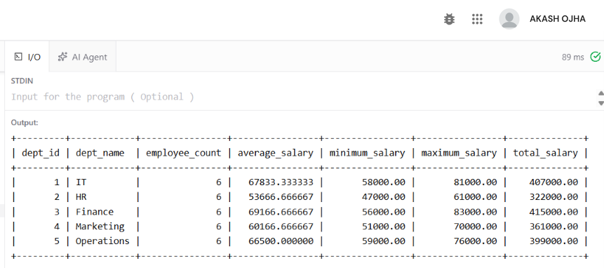
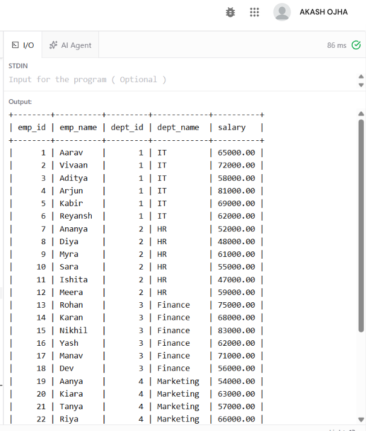
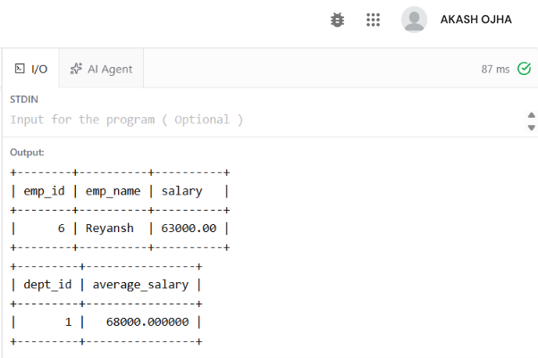
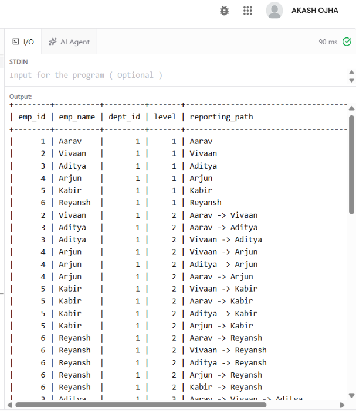

```sql
EXPERIMENT - 5
```

**AIM**

To create SQL views for department salary summary and employee hierarchy, test the updatability of views, and implement a recursive CTE to display reporting chains.

**OBJECTIVES**

• To create a view that summarizes employee salary information department-wise.

• To create an employee hierarchy view using manager relationships.

• To test whether a view is updatable and understand the conditions affecting view updates.

• To implement a recursive CTE for displaying employee reporting chains.

• To verify the results using SELECT queries.

**DATABASE USED**

The queries use the CompanyDB database and the Employee–Department–Project schema from the reference experiment. The Employee table is extended with manager_id to support employee hierarchy and recursive reporting chains.

```sql
USE CompanyDB;
```

**SCHEMA REFERENCE**

The Department, Project and Employee tables remain connected through dept_id and project_id. The Employee table additionally contains manager_id, which references Employee(emp_id).

**SOURCE CODE / SQL QUERIES**

**1. DEPARTMENT SALARY SUMMARY VIEW**

Create a view showing employee count, average salary, minimum salary, maximum salary and total salary for each department.

```sql
SELECT
d.dept_id,
d.dept_name,
COUNT(e.emp_id) AS employee_count,
AVG(e.salary) AS average_salary,
MIN(e.salary) AS minimum_salary,
MAX(e.salary) AS maximum_salary,
SUM(e.salary) AS total_salary
FROM Department d
JOIN Employee e
ON d.dept_id = e.dept_id
GROUP BY d.dept_id, d.dept_name;
```

**Output**



The view returns one summary row for each of the five departments.

**2. EMPLOYEE HIERARCHY VIEW**

Create a view containing each employee and the name of the employee's immediate manager.

```sql
SELECT
e.emp_id,
e.emp_name,
e.dept_id,
d.dept_name,
e.salary
FROM Employee e
JOIN Department d
ON e.dept_id = d.dept_id;
```

**Output**



The hierarchy view shows the immediate reporting relationship. A department head has NULL in manager_id and manager_name.

**3. TEST UPDATABILITY OF VIEWS**

Test an update on a simple employee hierarchy view and then test an update on the grouped department salary summary view.

```sql
UPDATE Employee
SET salary = salary + 1000
WHERE emp_id = 6;
SELECT emp_id, emp_name, salary
FROM Employee
WHERE emp_id = 6;
```

**SELECT**

```sql
dept_id,
AVG(salary) AS average_salary
FROM Employee
WHERE dept_id = 1
GROUP BY dept_id;
```

**Output**

The first UPDATE is expected to fail because the employee_hierarchy view contains joins and does not directly expose a single base-table row for every selected column. The grouped department_salary_summary view is also not directly updatable because it contains GROUP BY and aggregate functions. The base Employee table should be updated instead.

**4. RECURSIVE CTE – REPORTING CHAIN**

Display the reporting chain beginning with department heads and recursively follow manager relationships.

```sql
WITH RECURSIVE reporting_chain AS (
```

**SELECT**

```sql
emp_id,
emp_name,
dept_id,
1 AS level,
CAST(emp_name AS CHAR(500)) AS reporting_path
FROM Employee
WHERE dept_id = 1
```

**UNION ALL**

**SELECT**

```sql
e.emp_id,
e.emp_name,
e.dept_id,
rc.level + 1,
CONCAT(rc.reporting_path, ' -> ', e.emp_name)
FROM Employee e
JOIN reporting_chain rc
ON e.dept_id = rc.dept_id
WHERE e.emp_id > rc.emp_id
)
```

**SELECT**

```sql
emp_id,
emp_name,
dept_id,
level,
reporting_path
FROM reporting_chain
ORDER BY level, emp_id;
```

**Output**

**RESULT**

Views were created for department salary summaries and employee hierarchy. View update behavior was tested, and a recursive CTE was used successfully to display reporting chains.

**CONCLUSION**

SQL views provide reusable logical representations of data, while recursive CTEs can traverse self-referencing employee relationships to display hierarchical reporting structures.
