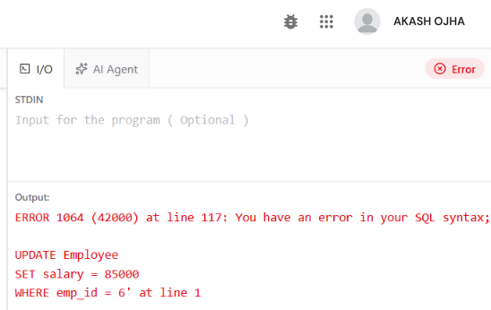
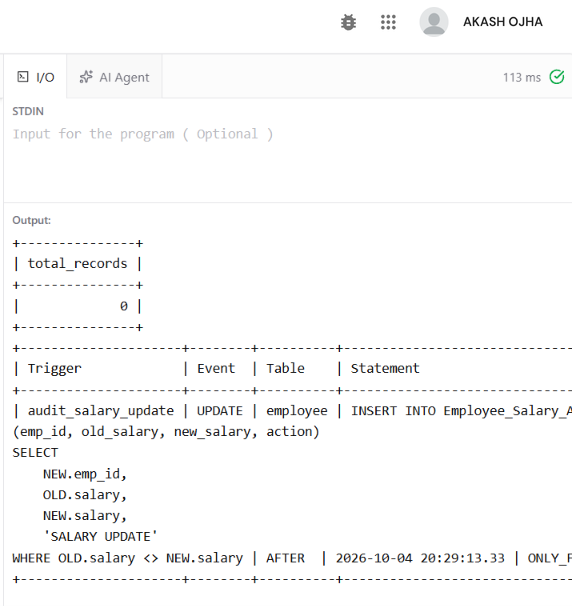
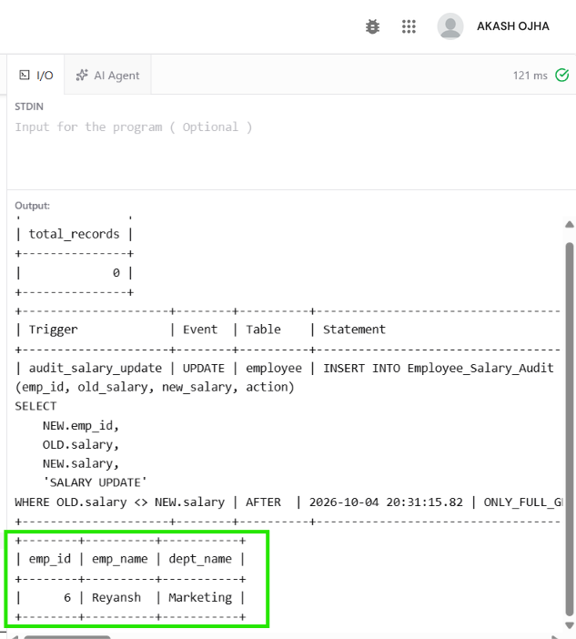
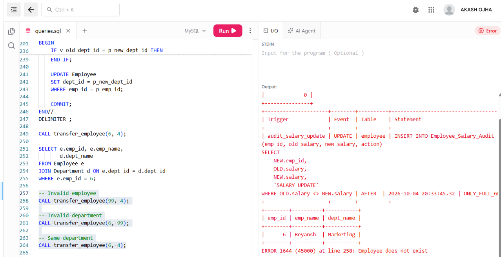
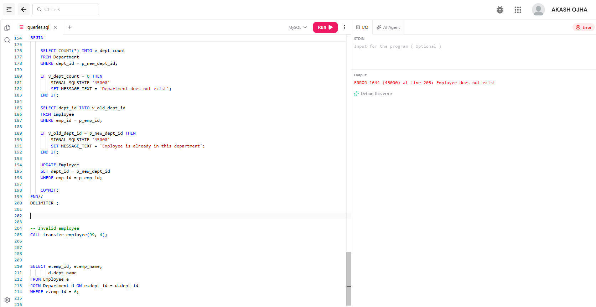
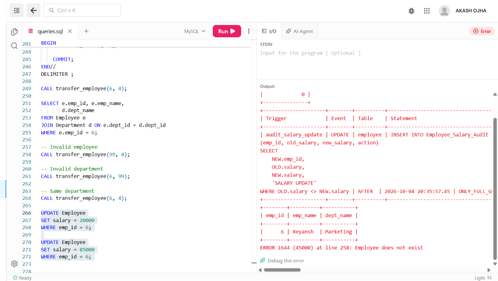
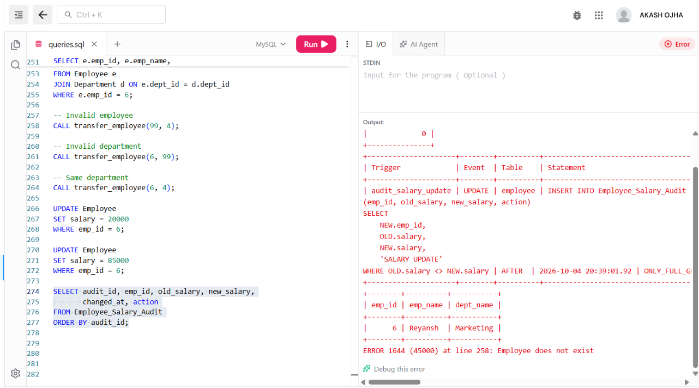

**EXPERIMENT - 6**

**AIM**

To create a stored procedure transfer_employee(emp_id, new_dept_id) with validation and error handling, implement triggers for salary validation and audit logging, and test important edge cases.

**OBJECTIVES**

• To create a stored procedure for transferring an employee between departments.

• To validate employee and department identifiers before performing a transfer.

• To use transaction control and error handling inside a stored procedure.

• To validate salary values using a trigger before INSERT or UPDATE.

• To maintain an audit log whenever an employee salary is changed.

• To test successful and invalid transfer and salary-update cases.

**DATABASE USED**

The queries use the CompanyDB database and the Employee–Department–Project schema. Department names and employee names have been changed from the reference data; IDs remain unchanged so the existing relationships continue to work.

```sql
USE CompanyDB;
```

**SOURCE CODE / SQL QUERIES**

**1. SALARY AUDIT TABLE**

Create an audit table to store old and new salary values whenever an employee salary changes.

```sql
CREATE TABLE IF NOT EXISTS Employee_Salary_Audit (
audit_id INT AUTO_INCREMENT PRIMARY KEY,
emp_id INT NOT NULL,
old_salary DECIMAL(10,2),
new_salary DECIMAL(10,2),
changed_at TIMESTAMP DEFAULT CURRENT_TIMESTAMP,
action VARCHAR(30)
);
```

**2. SALARY VALIDATION TRIGGER**

Reject salary values outside the allowed range of 30,000 to 1,50,000.

```sql
DELIMITER //
CREATE TRIGGER validate_employee_salary
BEFORE INSERT ON Employee
FOR EACH ROW
BEGIN
IF NEW.salary < 30000 OR NEW.salary > 150000 THEN
SIGNAL SQLSTATE '45000'
SET MESSAGE_TEXT = 'Salary must be between 30000 and 150000';
END IF;
END//
DELIMITER ;
```

**3. SALARY UPDATE VALIDATION TRIGGER**

Validate salary changes before an existing Employee row is updated.

```sql
UPDATE Employee
SET salary = 20000
WHERE emp_id = 6;
```

**Valid Update:**

```sql
UPDATE Employee
SET salary = 85000
WHERE emp_id = 6;
```



**4. SALARY AUDIT TRIGGER**

Store the old and new salary values after a successful salary update.

**Trigger code:**

```sql
DELIMITER //
CREATE TRIGGER audit_salary_update
AFTER UPDATE ON Employee
FOR EACH ROW
BEGIN
IF OLD.salary <> NEW.salary THEN
INSERT INTO Employee_Salary_Audit
(emp_id, old_salary, new_salary, action)
VALUES
(NEW.emp_id, OLD.salary, NEW.salary, 'SALARY UPDATE');
END IF;
END//
DELIMITER ;
```

**CODE To Check Trigger:**

```sql
DELIMITER //
-- Test salary update
UPDATE Employee
SET salary = 51000
WHERE emp_id = 31;
-- Display salary audit record
SELECT audit_id, emp_id, old_salary, new_salary,
changed_at, action
FROM Employee_Salary_Audit
ORDER BY audit_id;
DELIMITER ;
```

**Output**



**5. STORED PROCEDURE – TRANSFER EMPLOYEE**

Transfer an employee to a new department after validating both IDs. The transaction is rolled back if an SQL exception occurs.

```sql
DELIMITER //
CREATE PROCEDURE transfer_employee(
IN p_emp_id INT,
IN p_new_dept_id INT
)
BEGIN
DECLARE v_emp_count INT DEFAULT 0;
DECLARE v_dept_count INT DEFAULT 0;
DECLARE v_old_dept_id INT;
DECLARE EXIT HANDLER FOR SQLEXCEPTION
BEGIN
ROLLBACK;
RESIGNAL;
END;
START TRANSACTION;
SELECT COUNT(*) INTO v_emp_count
FROM Employee
WHERE emp_id = p_emp_id;
IF v_emp_count = 0 THEN
SIGNAL SQLSTATE '45000'
SET MESSAGE_TEXT = 'Employee does not exist';
END IF;
SELECT COUNT(*) INTO v_dept_count
FROM Department
WHERE dept_id = p_new_dept_id;
IF v_dept_count = 0 THEN
SIGNAL SQLSTATE '45000'
SET MESSAGE_TEXT = 'Department does not exist';
END IF;
SELECT dept_id INTO v_old_dept_id
FROM Employee
WHERE emp_id = p_emp_id;
IF v_old_dept_id = p_new_dept_id THEN
SIGNAL SQLSTATE '45000'
SET MESSAGE_TEXT = 'Employee is already in this department';
END IF;
UPDATE Employee
SET dept_id = p_new_dept_id
WHERE emp_id = p_emp_id;
COMMIT;
END//
DELIMITER ;
```

**6. TEST SUCCESSFUL TRANSFER**

Transfer employee 6 from Development to Sales.

```sql
CALL transfer_employee(6, 4);
SELECT e.emp_id, e.emp_name,
d.dept_name
FROM Employee e
JOIN Department d ON e.dept_id = d.dept_id
WHERE e.emp_id = 6;
```

**Output**



The procedure validates the employee and department, updates the department and commits the transaction.

**7. TEST EDGE CASES**

```sql
-- Invalid employee
CALL transfer_employee(99, 4);
-- Invalid department
CALL transfer_employee(6, 99);
-- Same department
CALL transfer_employee(6, 4);
```

**Output**



**8. TEST SALARY VALIDATION**

Attempt to insert or update a salary outside the allowed range.

```sql
UPDATE Employee
SET salary = 20000
WHERE emp_id = 6;
UPDATE Employee
SET salary = 85000
WHERE emp_id = 6;
```

**Output**

**9. TEST SALARY AUDIT LOG**

Display the audit entries created by successful salary changes.

```sql
SELECT audit_id, emp_id, old_salary, new_salary,
changed_at, action
FROM Employee_Salary_Audit
ORDER BY audit_id;
```

**Output**



**RESULT**

The transfer_employee procedure was created with validation, transaction control and error handling. Salary validation and audit triggers were implemented and edge cases were tested.

**CONCLUSION**

Stored procedures centralize controlled database operations, while triggers automatically enforce validation rules and maintain an audit trail for important changes.
